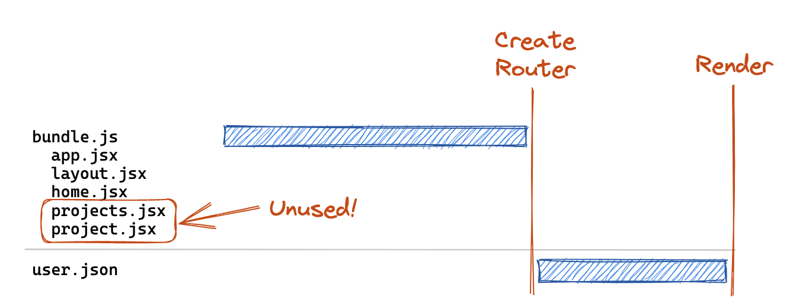

# Lazy Load

El "Lazy Load" (carga perezosa) no es exclusivo del enrutador de React (React Router), sino que es un concepto más amplio y una práctica común en el desarrollo web, aplicable a varias tecnologías y frameworks.

* **En el Contexto de React**: En React, el Lazy Load se implementa comúnmente utilizando React.lazy() y Suspense. Estas características permiten dividir el código de la aplicación en chunks (fragmentos) que se cargan solo cuando son necesarios. Esto no está directamente ligado a React Router, aunque a menudo se usa en conjunto con él para optimizar la carga de componentes asociados a diferentes rutas.

* **En Otras Tecnologías y Frameworks**: El concepto de Lazy Load también se aplica en otros frameworks y bibliotecas, tanto en el desarrollo frontend como backend. Por ejemplo, en Angular, Vue.js, y otros frameworks de JavaScript, existen técnicas similares para cargar componentes o módulos de forma perezosa.

* **Uso General en Desarrollo Web**: Más allá de los frameworks de JavaScript, Lazy Load se usa en varias formas en el desarrollo web, como en la carga perezosa de imágenes y otros recursos. Esto significa que los recursos solo se cargan cuando son visibles o necesarios en la página, lo cual es una práctica común para mejorar el rendimiento y la eficiencia.

Aunque el Lazy Load se utiliza frecuentemente en combinación con React Router en aplicaciones React para optimizar la carga de componentes de ruta, es un concepto y una práctica general en el desarrollo web que va más allá de cualquier herramienta o framework específico.

Veamos el problema que vienen a "solucionar" en las SPA:

Este usuario todavía tiene que descargar los cargadores y componentes para las rutas project y projects, ¡aunque no los necesite! Y en el peor de los casos, el usuario nunca los necesitará si no navega por esas rutas. Esto no puede ser ideal para nuestra UX.

## Lazy Load en React
En React, la carga perezosa (Lazy Loading) no se realiza por defecto; requiere una configuración explícita. Para implementarlo, en una aplicación React, utilizaremos [React.lazy()](https://react.dev/reference/react/lazy) junto con [React.Suspense()](https://react.dev/reference/react/Suspense), que son características proporcionadas por React para este propósito.

Veamos un ejemplo básico de cómo implementar Lazy Load en React:

Importamos React.lazy y Suspense:

~~~
import React, { Suspense, lazy } from 'react';
~~~ 

Utilizamos React.lazy() para cargar un componente de forma perezosa:

~~~
const LazyComponent = lazy(() => import('./LazyComponent'));
~~~ 

En este ejemplo, LazyComponent es un componente que se cargará solo cuando sea necesario (por ejemplo, cuando se acceda a la ruta correspondiente).

Envolvemos el componente perezoso con Suspense:

~~~
function App() {
  return (
    <Suspense fallback={
Cargando...
}>
      <LazyComponent />
    </Suspense>
  );
}
~~~ 

El prop fallback de Suspense es lo que se muestra mientras el componente está cargando (por ejemplo, un mensaje de carga o un spinner).

Integración con React Router:
Si estás utilizando React Router, puedes integrar Lazy Load con las rutas:

~~~
import { BrowserRouter as Router, Route, Switch } from 'react-router-dom';

function App() {
  return (
    <Router>
      <Suspense fallback={
Cargando...
}>
        <Switch>
          <Route path="/lazy-component" element={LazyComponent} />
          {/* otras rutas */}
        </Switch>
      </Suspense>
    </Router>
  );
}
~~~ 

## Lazy load Router 6.9

A partir de React Router v6.9.0, se añadió una nueva funcionalidad llamada Route.lazy, que ofrece una forma más integrada y eficiente de manejar la carga perezosa directamente dentro de las definiciones de las rutas.

La diferencia clave es que mientras React.lazy() se enfoca en cargar componentes de manera perezosa dentro del ciclo de renderizado, Route.lazy en React Router v6.9.0 permite introducir la carga perezosa fuera del ciclo de renderizado. Esto es particularmente útil para optimizar tanto la carga de componentes como la obtención de datos de manera más efectiva, reduciendo el tamaño del paquete inicial crítico y mejorando el rendimiento durante las navegaciones subsiguientes.

A continuación, vemos un ejemplo de cómo podemos implementarlo en nuesrta aplicación React:

* Definimos las Rutas con Route.lazy:
Primero, definiremos las rutas utilizando el nuevo método lazy() para cargar los componentes de manera perezosa. Esto significa que los componentes solo se cargarán cuando sean necesarios, es decir, cuando el usuario navegue a la ruta correspondiente.

~~~
import { BrowserRouter as Router, Routes, Route } from 'react-router-dom';

// Aquí estamos utilizando la nueva función `lazy` de React Router
const Home = Route.lazy(() => import('./Home'));
const About = Route.lazy(() => import('./About'));
const Contact = Route.lazy(() => import('./Contact'));

function App() {
  return (
    <Router>
      <Routes>
        <Route path="/" element={<Home />} />
        <Route path="/about" element={<About />} />
        <Route path="/contact" element={<Contact />} />
        {/* otras rutas */}
      </Routes>
    </Router>
  );
}
~~~

En este ejemplo, Home, About y Contact son componentes que se cargan de manera perezosa.

* Uso de Suspense:
Aunque Route.lazy maneja la carga perezosa, aún necesitarás usar Suspense de React para definir un componente de fallback que se mostrará mientras se carga el componente perezoso.

~~~
import React, { Suspense } from 'react';
// ... (importaciones y definiciones de rutas como antes)

function App() {
  return (
    <Router>
      <Suspense fallback={
Cargando...
}>
        <Routes>
          {/* tus rutas definidas aquí */}
        </Routes>
      </Suspense>
    </Router>
  );
}
~~~

Este enfoque reduce el tamaño del paquete inicial necesario para cargar la aplicación, ya que los componentes para rutas específicas solo se cargarán cuando se acceda a ellas. Es una manera efectiva de mejorar el rendimiento de las aplicaciones SPA (Single Page Application) al minimizar el tiempo de carga inicial y los recursos necesarios.

Para más detalles y ejemplos, revisar la [documentación oficial de React Router](https://reactrouter.com/en/main/route/lazy).